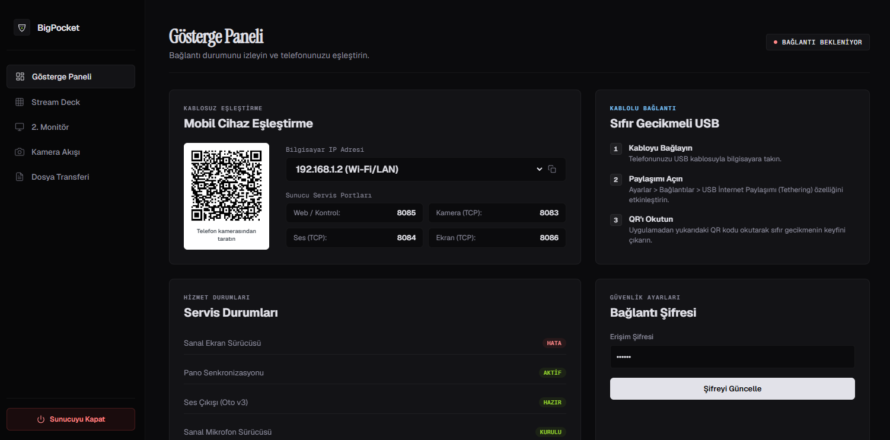

# BigPocket 📱💻

**BigPocket**, Windows bilgisayarınızı akıllı telefonunuz üzerinden sıfır gecikmeyle kontrol etmenizi, yönetmenizi ve telefonunuzu çok işlevli bir **Sanal 2. Monitör, Sanal Mikrofon, Stream Deck** veya **Webcam** aygıtına dönüştürmenizi sağlayan modern, yüksek performanslı ve açık kaynaklı bir uzaktan yönetim sistemidir.

Go (Masaüstü Sunucusu) ve Kotlin/Jetpack Compose (Android İstemcisi) mimarisi ile maksimum performansı ve minimum gecikmeyi hedefler.

---

## 🚀 Temel Özellikler

### 1. Sanal İkinci Ekran (Virtual Second Screen) 🖥️
*   **Donanım Simülasyonu:** Bilgisayarınıza sanal bir ekran sürücüsü (Indirect Display Driver) yükleyerek telefonunuzu gerçek bir ikinci monitör olarak kullanmanızı sağlar.
*   **Dokunmatik Kontrol:** Telefon ekranından bilgisayarın 2. ekranındaki pencereleri doğrudan dokunarak kontrol edebilir, tıklama ve sürükleme işlemlerini yapabilirsiniz.
*   **Çift Yönlü Modlar:** Dikey veya yatay modlarda çalışabilir. İsterseniz tam ekran (Full Screen) yaparak tüm alanı monitör olarak kullanabilirsiniz.

### 2. Sanal Mikrofon (Virtual Mic) 🎤
*   **Gecikmesiz Ses Akışı:** Telefonunuzun mikrofonunu Windows'a gerçek bir ses giriş aygıtı (mikrofon) olarak tanıtır.
*   **Özel Yönlendirme:** Ses bilgisayar hoparlöründen çıkmaz, doğrudan sanal ses aygıtına (VB-Cable) akar. Discord, Zoom, Teams ve OBS gibi programlarda mikrofon olarak seçilebilir.
*   **Ses Kontrol Paneli Entegrasyonu:** Kurulum sonrası varsayılan ses çıkış cihazınızın değişmesi durumunda tek tıkla Windows Ses Denetim Masası'nı açarak hoparlörünüzü varsayılana geri döndürebilirsiniz.

### 3. Özelleştirilebilir Stream Deck 🎛️
*   **Dinamik Buton Izgarası:** Satır ve sütun sayılarını arayüzden dilediğiniz gibi değiştirebilirsiniz (örn. 2x4, 3x5 vb.).
*   **Otomatik Uygulama Tespiti:** Bilgisayarınızda kurulu olan tüm programları otomatik olarak listeler ve tek tıkla butonlara atamanıza olanak tanır.
*   **İkon Çıkarıcı:** Atadığınız Windows uygulamalarının logolarını (EXE ve Kısayol dosyalarından) otomatik olarak ayıklar ve telefon butonunuza ikon olarak atar.
*   **Gelişmiş Komut & Kısayol Desteği:**
    *   **Klavye Kısayolları (Hotkey):** `ctrl+shift+esc`, `meta+d` gibi kombinasyonları veya ses açma/kapatma gibi medya tuşlarını atayabilirsiniz.
    *   **Shell Komutları:** Herhangi bir CLI komutunu veya `.bat` scriptini arka planda sessizce tetikleyebilirsiniz.
    *   **Hazır Şablonlar:** Geliştiriciler (VS Code, Terminal, Git Bash), Oyuncular (Discord mute, Geforce, Steam) ve Medya için önceden tanımlanmış hazır şablonları anında uygulayabilirsiniz.

### 4. Sanal Mouse (Trackpad) & Klavye 🖱️⌨️
*   **Çoklu Dokunmatik Hareketler (Multi-touch):**
    *   *Tek Parmak:* İmleç hareketi ve sol tıklama.
    *   *Çift Parmak Tıklama:* Sağ tıklama.
    *   *Çift Parmak Sürükleme:* Dikey kaydırma (Scroll wheel).
*   **Tam Klavye Yazımı:** Türkçe karakter desteğiyle telefon klavyenizden PC'ye anında yazı yazabilir, `Enter` ve `Backspace` tuşlarını kullanarak yazdıklarınızı silebilirsiniz.

### 5. Yüksek Kaliteli Kamera Akışı (Webcam) 📷
*   **Kablosuz/Kablolu Webcam:** Telefonunuzun ön veya arka kamerasını bilgisayara yüksek kaliteli MJPEG akışı olarak aktarabilirsiniz.
*   **OBS & Yayın Desteği:** Akışı doğrudan OBS Studio veya tarayıcı üzerinden yakalayarak yayınlarınızda kullanabilirsiniz.

### 6. Dosya Transferi & Pano Senkronizasyonu 📁📋
*   **Dosya Paylaşımı:** Sürükle-bırak yöntemiyle telefonunuzdan bilgisayara, bilgisayardan telefonunuza sınırsız boyutta dosya aktarabilirsiniz.
*   **Anlık Pano (Clipboard) Eşitleme:** Bilgisayarda kopyaladığınız bir metin anında telefona, telefonda kopyaladığınız metin ise anında bilgisayar panosuna aktarılır.

---

## 🔌 Bağlantı Seçenekleri

### ⚡ Sıfır Gecikmeli USB Bağlantısı (Önerilen)
Gecikmesiz bir deneyim için kablolu bağlantı kullanılması tavsiye edilir:
1.  Telefonu USB kablosuyla bilgisayara bağlayın.
2.  Telefondan **Ayarlar > Bağlantılar > USB İnternet Paylaşımı (Tethering)** özelliğini açın.
3.  Bilgisayar arayüzünde "Bilgisayar IP Adresi" listesinden otomatik olarak tespit edilen **(USB Tethering)** IP'sini seçin.
4.  Telefon uygulamasından **"USB ile Otomatik Bağlan"** butonuna basarak veya QR kodu taratarak sıfır gecikmeli bağlantıyı başlatın.

### 📶 Wi-Fi / Yerel Ağ Bağlantısı
1.  Bilgisayarınızın ve telefonunuzun aynı Wi-Fi ağına bağlı olduğundan emin olun.
2.  Bilgisayar arayüzünde yerel IP'nizi seçin ve telefon uygulamasından QR kodu taratın.

---

## 📦 Kurulum ve Çalıştırma

### Windows Sunucusu (Bilgisayar)
1.  Ana dizindeki **[Setup.exe](Setup.exe)** dosyasını çalıştırın.
2.  Yönetici yetkisini onaylayın. Uygulama otomatik olarak `C:\Program Files\BigPocket` dizinine kurulacak, masaüstü kısayolu oluşturulacak ve **arka planda tamamen gizli/terminal penceresiz** olarak çalışmaya başlayacaktır.
3.  *Kaldırmak için:* Windows Başlat menüsünden veya Denetim Masası "Program Ekle/Kaldır" arayüzünü kullanarak kolayca kaldırabilirsiniz.

### Android İstemcisi (Telefon)
1.  Ana dizindeki **[BigPocket.apk](BigPocket.apk)** dosyasını telefonunuza yükleyin.
2.  Kamera ve mikrofon izinlerini onaylayın.

---

## ⚙️ Sürücü Kurulumları ve Yapılandırma

*   **Sanal Monitör Sürücüsü:** Uygulama arayüzündeki "Sanal 2. Monitör" sekmesinden sürücüyü manuel olarak kurabilir ve dilediğiniz zaman sanal ekranı aktif/pasif hale getirebilirsiniz.
*   **Sanal Mikrofon Sürücüsü:** "Sanal Mikrofon" kartındaki butona basarak kurulumu yapın. Kurulum bittiğinde varsayılan ses çıkış cihazınızın değişmemesi için çıkacak diyalogdaki **"Ses Kontrol Panelini Aç"** butonuna basıp kendi hoparlörünüzü tekrar varsayılan yapabilirsiniz.

---

## 📄 Lisans
Bu proje açık kaynaklı olup **MIT Lisansı** altında dağıtılmaktadır. Kodları dilediğiniz gibi değiştirebilir, kişiselleştirebilir ve katkıda bulunabilirsiniz.
